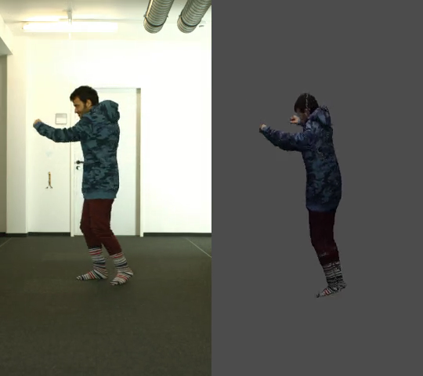

This work is one of my undergraduate projects, done in the Geometric Image Processing(GIP) lab in the Technion.
In this work we did a partial implementation of the paper [LiveCap](https://gvv.mpi-inf.mpg.de/projects/LiveCap/). 
It is about moving a 3d model of a person in so that the model's movement will match the movement seen in the video.
It involved many topics, including:
* deep learning
* computer vision
* non linear least squares optimization
* computer graphics
* python programing
   
It is a little cranky, but me and my partner learned a lot from this project.

* <a href="../static/reports/gip.pdf">report</a>
* slides - [pptx](../static/slides/gip.pptx), <a href="../static/slides/gip.pdf">pdf</a>
* code - [github](https://github.com/izosak/LiveCapCover.git)

