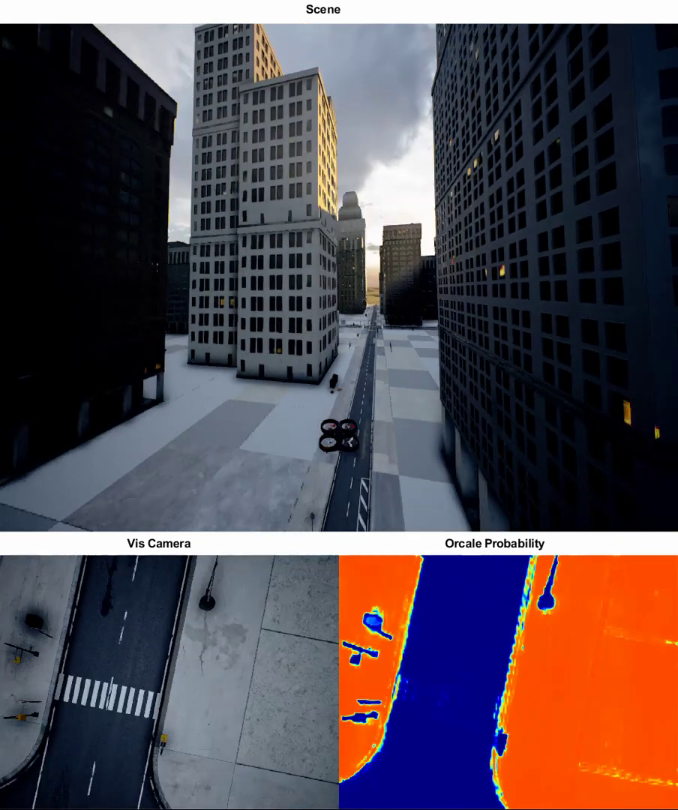

This work is one of my undergraduate projects, done in the Intelegent Systems(ISL) lab in the Technion [website](https://isl.cs.technion.ac.il/).
This is part of a larger project of autonomous landing in an urban environment done in the lab. It involves extracting information from an image about what are the places that are safe for landing, and what are dangerous.
It involved many topics, including:
* deep learning
* computer vision
* python programing

The source code is not available as it is part of a larger project, still in development.

* <a href="../static/reports/isl.pdf">report</a>
* slides - [pptx](../static/slides/isl.pptx), <a href="../static/slides/isl.pdf">pdf</a>

